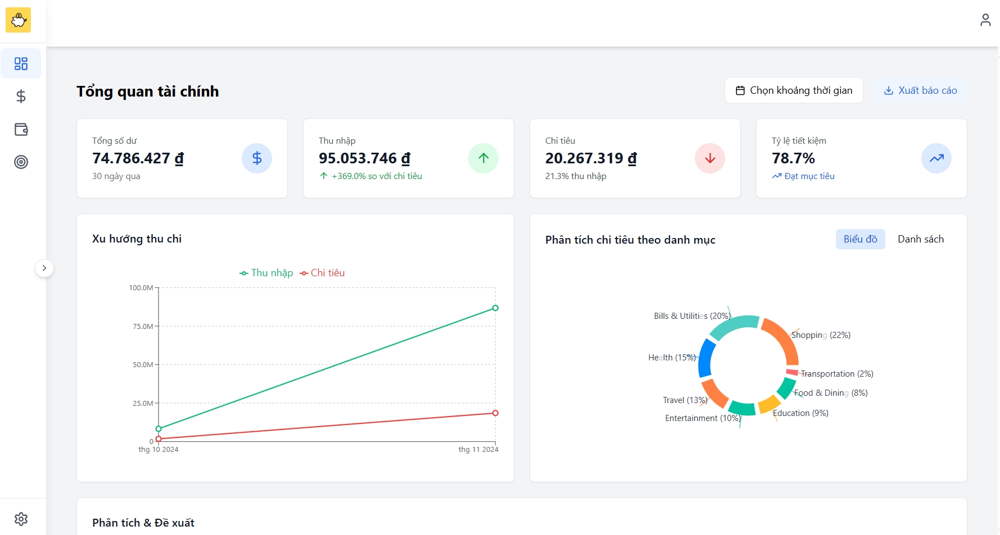
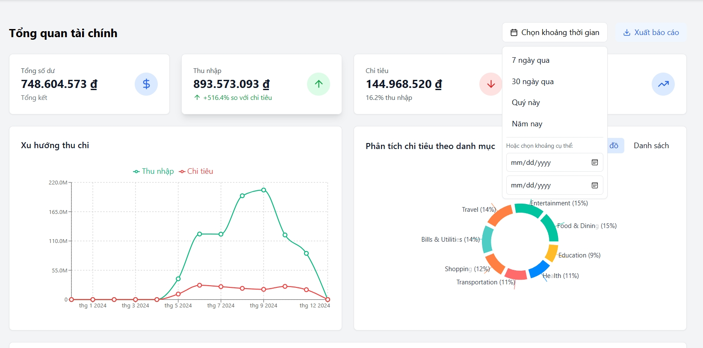
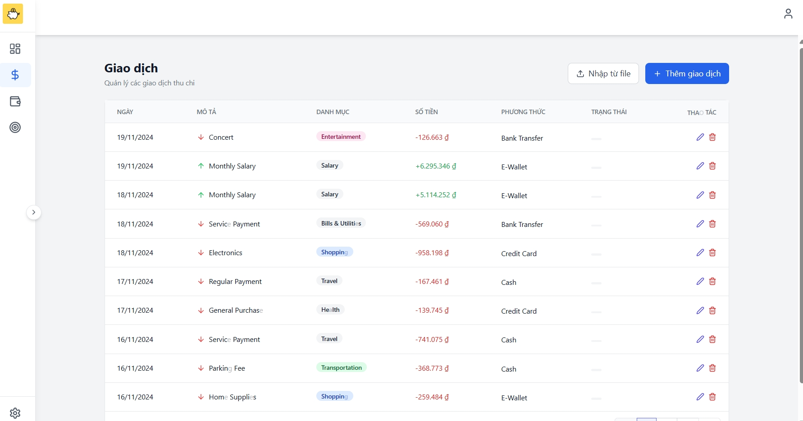
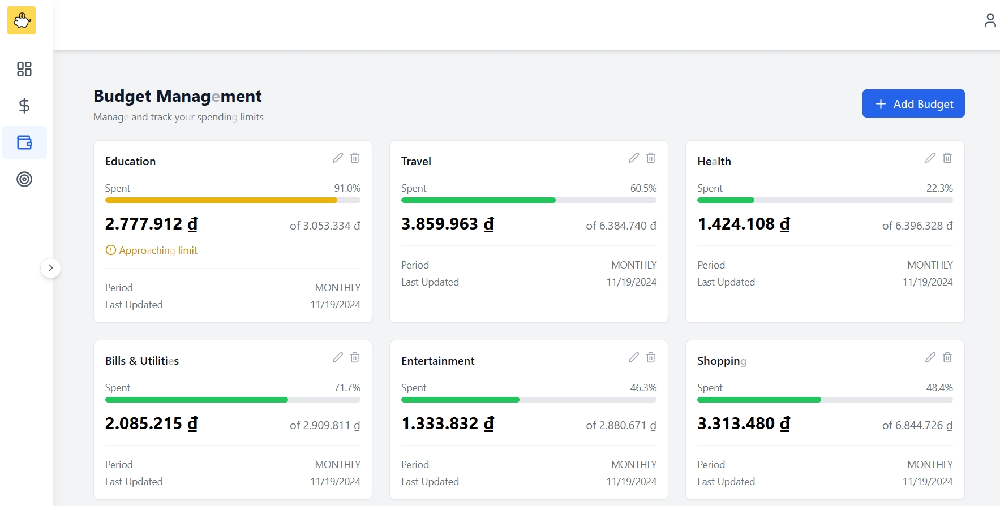
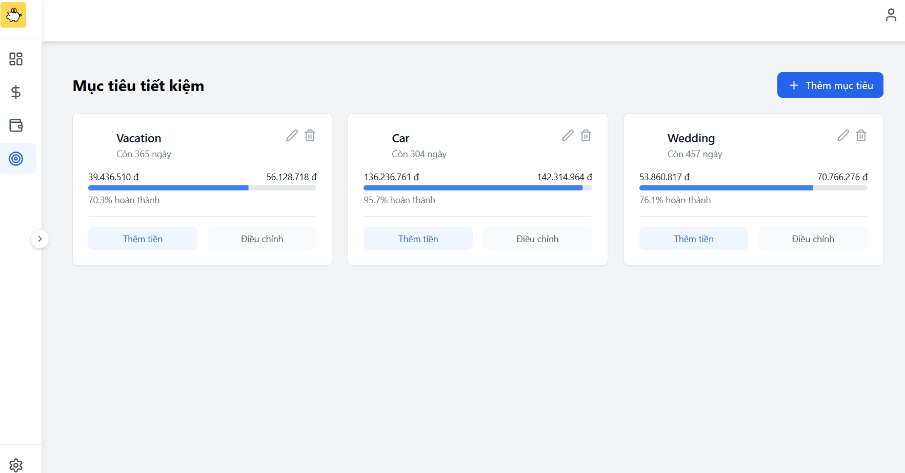
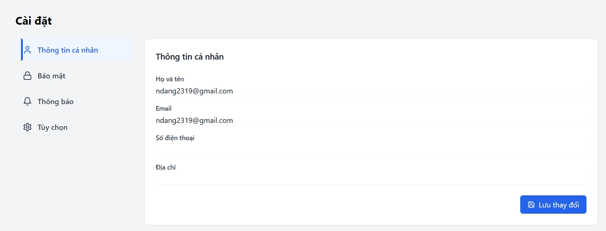
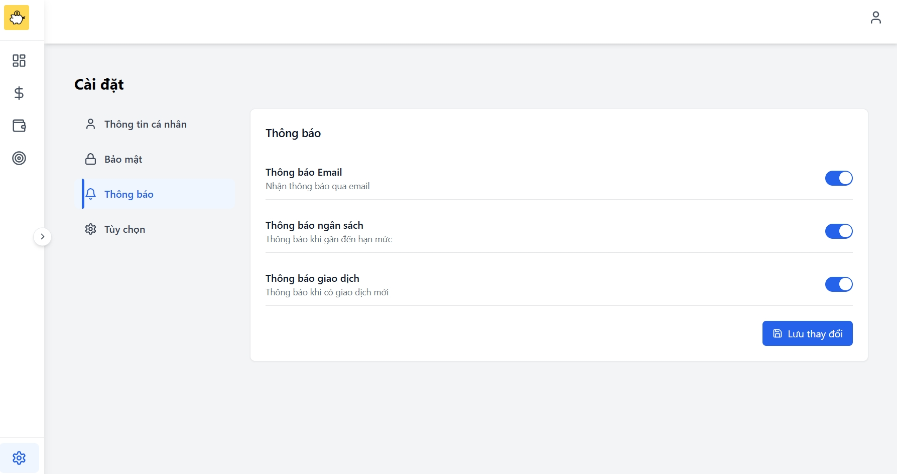

# 💰 Personal Finance Tracker

<div align="center">


<h3>🚀 Quản lý tài chính cá nhân một cách thông minh và hiệu quả</h3>

</div>

## 📸 Preview

<div align="center">

<details>
<summary><h3>🖥️ Dashboard</h3></summary>

|                            Dashboard Overview                             |
| :-----------------------------------------------------------------------: |
|  |

|                                    Dashboard with Filters                                    |
| :------------------------------------------------------------------------------------------: |
|  |

|                                       Export/Import Templates                                        |
| :--------------------------------------------------------------------------------------------------: |
|  📄 [Finance Report (PDF)](./frontend-finance-tracker/public/template-exported/finance-report.pdf)   |
| 📊 [Finance Report (Excel)](./frontend-finance-tracker/public/template-exported/finance-report.xlsx) |

> Download our template files to easily import/export your financial data

</details>

<details>
<summary><h3>💰 Transactions & Budgets & Goal</h3></summary>

|                             Transaction Management                              |                            Budget Planning                            |
| :-----------------------------------------------------------------------------: | :-------------------------------------------------------------------: |
|  |  |

|                          Financial Goals                          |
| :---------------------------------------------------------------: |
|  |

</details>

<details>
<summary><h3>📱 Settings </h3></summary>

|                                 User Profile                                  |                                  Notification Settings                                  |
| :---------------------------------------------------------------------------: | :-------------------------------------------------------------------------------------: |
|  |  |

</details>

</div>

## ✨ Tính năng nổi bật

<div align="center">

| 📊 Dashboard trực quan |   💸 Theo dõi thu chi   |  🎯 Mục tiêu tài chính   |
| :--------------------: | :---------------------: | :----------------------: |
|  📅 Quản lý ngân sách  | 📱 Giao diện responsive | 🔄 Import/Export dữ liệu |
|  📈 Báo cáo chi tiết   |  📊 Phân tích xu hướng  | 🔔 Thông báo thông minh  |

</div>

## 🛠️ Tech Stack

<div align="center">

### Frontend


### Backend


</div>

## 🚀 Quick Start

```bash
# Frontend
git clone https://github.com/TH-NDang/PersonalFinanceWeb
cd frontend-finance-tracker
npm install && npm run dev

# Backend
cd finance-tracker-api
./mvnw clean install
./mvnw spring-boot:run
```

## 🌐 Environment Setup

```properties
# Backend application.properties
spring.datasource.url=jdbc:postgresql://localhost:5432/finance_tracker
spring.datasource.username=your_username
spring.datasource.password=your_password
```

## 👥 Contributors

<div align="center">

[](https://github.com/TH-NDang/PersonalFinanceWeb/graphs/contributors)

</div>

## 📜 License

<div align="center">

MIT License - See [LICENSE](LICENSE) for details

---

<p>Made with ❤️ by the Personal Finance Tracker Team</p>

</div>
